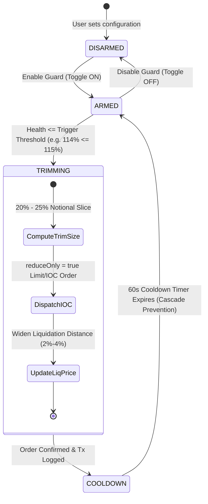
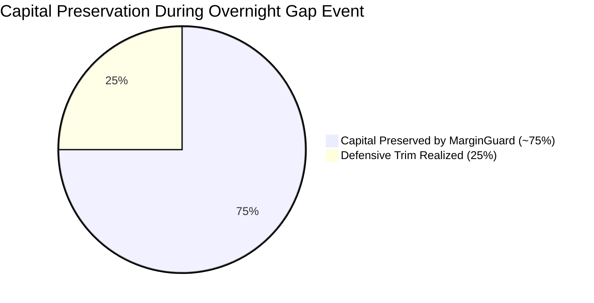

# MarginGuard for Mochatrade

> **Autonomous Liquidation Defense and Risk Mitigation Engine for Retail US Equity Perpetuals**  
> *Developed for the Mochatrade YC P26 Mumbai Hackathon (September 8–12, 2026)*

---

## 👥 Team FinalCommit
* **Aniket Gaikwad**
* **Harshil Amin**

📌 **Technical Documentation & Specs**: [MarginGuard Technical & Product Documentation on Notion](https://toothsome-buzzard-a8f.notion.site/MarginGuard-Technical-Product-Documentation-3d0412ca282c80dcaf9fdf6052e2ebb4)

---

## 🎯 Executive Summary & Problem

Mochatrade enables Indian retail traders to trade US equity perpetuals (**NVDA, TSLA, AAPL, AMZN, MSFT, META, GOOGL, COIN, AMD, SPY**) with up to **20× leverage** funded directly in **INR via instant UPI rails**.

However, high leverage combined with cross-border market dynamics introduces severe risks:

1. **Market Hour Disparity (Overnight Gap Risk)**: US after-hours sessions and high-beta earnings occur between **1:30 AM – 6:00 AM IST**, while Indian retail traders are asleep.
2. **Retail Liquidation Limitations**: On underlying perpetual L1 engines (like Hyperliquid), native partial liquidations are limited to institutional positions ($100k+ notional). Retail positions under $100k suffer **100% catastrophic wipeouts** through blunt market orders.
3. **Severe Trader Churn**: 75%+ of retail derivatives traders who experience total margin liquidation churn off platforms within 90 days.

**MarginGuard** solves this with a **client-authorized, non-custodial risk engine** that brings autonomous, multi-tiered partial deleveraging to retail positions—executing while the trader sleeps to keep the primary trade alive.

---

## 🏗️ System Architecture & End-to-End Data Flow

```mermaid
flowchart TD
    subgraph MarketData["1. Market Feeds & Ingestion"]
        HL["Hyperliquid L1 WebSocket / OrderBook"] --> Feed["Real-Time Price & Mark Telemetry"]
        Feed --> Jitter["Brownian Micro-Ticking Engine"]
    end

    subgraph ClientTerminal["2. Mochatrade Trading Terminal (Next.js 16 + React 19)"]
        Jitter --> LiveState["Live Market & Position State"]
        LiveState --> CanvasChart["Canvas Candlestick Chart with Overlays"]
        LiveState --> PosTable["Positions Table & Health Meter"]
        LiveState --> RiskCard["MarginGuard Control Card"]
    end

    subgraph RiskEngine["3. MarginGuard Autonomous Defense Engine"]
        LiveState --> HealthCheck{"Margin Health Ratio <= Threshold?"}
        HealthCheck -->|"No (Health > 115%)"| ArmedState["State: ARMED (Monitoring)"]
        HealthCheck -->|"Yes (Health <= 114%)"| TriggerTrim["State: TRIMMING (Fire Defense)"]
        
        TriggerTrim --> SliceCalc["Calculate 25% reduceOnly Trim Slice"]
        SliceCalc --> Signer["Scoped Session Key (EIP-712 Signer)"]
    end

    subgraph ExecutionLayer["4. Non-Custodial Order Dispatch"]
        Signer --> API["API: /api/simulate-trim Endpoint"]
        API -->|"With Private Key"| HLTestnet["Hyperliquid Testnet L1 Client"]
        API -->|"Without Key"| SimEngine["Deterministic L1 Simulator Engine"]
        
        HLTestnet --> MatchingEngine["L1 Matching Engine: IOC Batch Order"]
        SimEngine --> MatchingEngine
    end

    subgraph RecoveryState["5. Post-Execution & Cooldown"]
        MatchingEngine --> LogUpdate["Audit Log with Tx Hash & L1 Verification"]
        LogUpdate --> PosRebalance["Recalculate Notional, Buffer & Liquidation Price"]
        PosRebalance --> Toast["Audit Toast Notification"]
        PosRebalance --> Cooldown["State: COOLDOWN 60s"]
        Cooldown --> ArmedState
    end

    style RiskEngine fill:#042f2e,stroke:#14b8a6,stroke-width:2px;
    style ExecutionLayer fill:#1e1b4b,stroke:#6366f1,stroke-width:2px;
    style RecoveryState fill:#0f172a,stroke:#38bdf8,stroke-width:2px;
```



---

## 🔄 MarginGuard State Machine Flow



---

## ⚡ Core Defense Mechanics

| Mechanism | Description | Technical Implementation |
| :--- | :--- | :--- |
| **Multi-Tiered Deleveraging** | Continuously evaluates Margin Health Ratio ($$\text{Account Equity} / \text{Maintenance Margin}$$) against configurable trigger levels (110%, 115%, 120%, 125%). | Triggers an immediate targeted 20%–25% position slice reduction when health breaches the threshold. |
| **Liquidation Buffer Widening** | Trimming notional exposure immediately frees required maintenance margin. | Lowers liquidation price by **2% to 4%**, moving it further away from the current mark price. |
| **Non-Custodial Scoped Execution** | Scoped session keys / Hyperliquid Agent Wallets locked exclusively to `reduceOnly: true`. | Zero custody, zero withdrawal permissions, cannot initiate new directional trades. |
| **Slippage & Cooldown Protection** | Replaces aggressive market dumping with Immediate-or-Cancel (IOC) limit order batches. | Enforces a strict **60-second cooldown cycle** after each trim to prevent illiquid cascade loops. |
| **US Equity Perps Catalogue** | Full 24/7 perpetual market catalogue for top 10 US equities. | Supports NVDA, TSLA, AAPL, AMZN, MSFT, META, GOOGL, COIN, AMD, SPY with deterministic data generation. |

---

## 📊 Comparative Analysis: Forced Wipeout vs. MarginGuard



| Dimension | Exchange Forced Liquidation | Standard Static Stop-Loss | MarginGuard Auto-Defense |
| :--- | :--- | :--- | :--- |
| **Execution Trigger** | Maintenance margin breached | Static price point hit | Dynamic Margin Health ratio breach |
| **Position Impact** | **100% position wiped out** | 100% position dumped | **20% to 25% targeted trim** |
| **Capital Preserved** | **$0 (Margin seized by vault)** | Partial (exited at local bottom) | **~75% equity intact & protected** |
| **Trade Continuity** | Terminated | Terminated | **Trade remains active (captures upside)** |
| **Liquidation Penalty** | High liquidation clearance penalty | Normal taker fee | Standard taker fee |
| **Overnight Protection**| ❌ Unprotected | ⚠️ Vulnerable to slippage/wicks | ✅ Autonomous L1 defense |

---

## 🛠️ Technology Stack

| Layer | Technologies & Libraries |
| :--- | :--- |
| **Frontend Framework** | **Next.js 16.3.4** (App Router, Turbopack), **React 19.2.8** |
| **Language & Typing** | **TypeScript 5.x** |
| **Styling & UI** | **Tailwind CSS v4**, `@tailwindcss/postcss`, `lucide-react`, `clsx`, `tailwind-merge` |
| **Typography** | **Geist Sans** & **Geist Mono** (`next/font/google`) with tabular financial numerics |
| **Charts & Canvas** | Custom DPI-aware Canvas Candlestick Engine with EMA(20), dynamic levels & crosshair tooltips |
| **Blockchain / L1 Engine** | `@nktkas/hyperliquid` (Hyperliquid L1 Client), `viem` (EIP-712 typed signing) |
| **Testing & Invariants** | Node.js `assert` test runner with invariant and formula validation |

---

## 📂 Repository Structure

```text
.
├── Mochatrade.md                  # Hackathon product brief & platform vision
├── README.md                      # MarginGuard system architecture & flow documentation
├── project_context.md             # In-depth technical context & invariant verification
├── presentation.html              # Interactive web presentation deck
├── Mochatrade-MarginGuard.pptx    # Generated PowerPoint pitch deck
├── generate_pptx.mjs              # Automation script for pitch deck generation
└── web/                           # Next.js 16 web application & risk engine
    ├── src/
    │   ├── app/
    │   │   ├── layout.tsx         # Root layout with dark mode & typography
    │   │   ├── page.tsx           # Terminal orchestration & state bindings
    │   │   ├── globals.css        # Tailwind v4 theme, custom dark scrollbars
    │   │   └── api/
    │   │       └── simulate-trim/ # Fail-soft Hyperliquid Testnet order route
    │   ├── engine/
    │   │   ├── types.ts           # Type definitions (Positions, Health, Audit, Markets)
    │   │   ├── markets.ts         # 10-stock catalogue & deterministic seeded generators
    │   │   ├── useTerminalEngine.ts # Core state machine hook & Brownian micro-ticks
    │   │   └── engine.test.ts     # Comprehensive invariant & calculation test suite
    │   └── components/
    │       └── terminal/
    │           ├── Navbar.tsx         # Responsive top bar, ticker picker & UPI wallet
    │           ├── ChartPanel.tsx     # High-performance Canvas candlestick chart
    │           ├── PositionsTable.tsx # 4-tab panel: Positions, Logs, Book, Markets
    │           ├── OrderEntry.tsx     # 20x leverage order entry module
    │           ├── RiskShieldCard.tsx # MarginGuard configuration & live telemetry
    │           ├── PitchToolbar.tsx   # Interactive demo triggers (Overnight Dip, Reset)
    │           └── AuditToast.tsx     # Floating L1 defense confirmation toast
    ├── package.json               # Dependencies & scripts
    └── tsconfig.json              # TypeScript compilation rules
```

---

## 🚀 Getting Started & Local Development

### 1. Prerequisites
* **Node.js** `v18.x` or `v20.x+`
* **npm**, **pnpm**, or **yarn**

### 2. Installation
```bash
# Clone the repository
git clone git@github.com:Anii230/Mochatrade-YC-P26-Mumbai-Hack.git
cd Mochatrade-YC-P26-Mumbai-Hack/web

# Install dependencies
npm install
```

### 3. Run Development Server
```bash
npm run dev
```
Open [http://localhost:3000](http://localhost:3000) in your browser.

### 4. Run Verification & Test Suite
Verify that all mathematical invariants, margin health ratios, and trim calculations pass:
```bash
npx tsx src/engine/engine.test.ts
```

### 5. Build for Production
```bash
npm run build
```

---

## 🎮 Interactive Demo Walkthrough

1. **Observe Normal State**: The terminal boots with a **20× Long NVDA** position ($10,000 notional) with MarginGuard **ARMED** at a **115% threshold** and a **25% trim slice**.
2. **Select Stock Markets**: Switch seamlessly between **NVDA, TSLA, AAPL, AMZN, MSFT, META, GOOGL, COIN, AMD, SPY** using the top ticker selector or the **"US Stock Perps"** tab.
3. **Simulate Overnight Gap-Down**: Click **`⚡ Simulate -4% Overnight Dip`** in the bottom Pitch Toolbar.
4. **Watch Autonomous Defense**:
   * Mark price drops to **$115.10**, dropping Margin Health to **114%** (breaching the 115% threshold).
   * State machine instantly transitions from `ARMED` → `TRIMMING`.
   * An autonomous `reduceOnly: true` order trims **$2,500 (25%)** of the position.
   * Liquidation price expands downward from **$114.20 → $108.43**.
   * Margin Health is restored to **126.2% (SAFE)**.
   * State transitions to `COOLDOWN (60s)` with an animated countdown.
   * An **Audit Toast** pops up displaying the EIP-712 L1 verified transaction hash and telemetry.
5. **Reset & Test Edge Cases**: Click **`🔄 Reset Position`** or toggle MarginGuard **OFF** to witness how an unprotected position risks full liquidation.

---

## 🔒 Security & Non-Custodial Architecture

* **Zero Asset Custody**: MarginGuard agents operate via scoped session keys restricted strictly to `reduceOnly: true` orders.
* **No Withdrawal Access**: The delegated key has zero rights to transfer funds, withdraw collateral, or execute external transactions.
* **No Directional Expansion**: Session keys cannot open new positions or increase leverage; orders can only reduce existing risk.
* **Fail-Soft L1 Integration**: The order dispatch API seamlessly interacts with Hyperliquid Testnet and gracefully falls back to deterministic simulation if keys are omitted.

---

<div align="center">
  <sub>Built with ❤️ for Mochatrade YC P26 Mumbai Hackathon by Team FinalCommit</sub>
</div>
